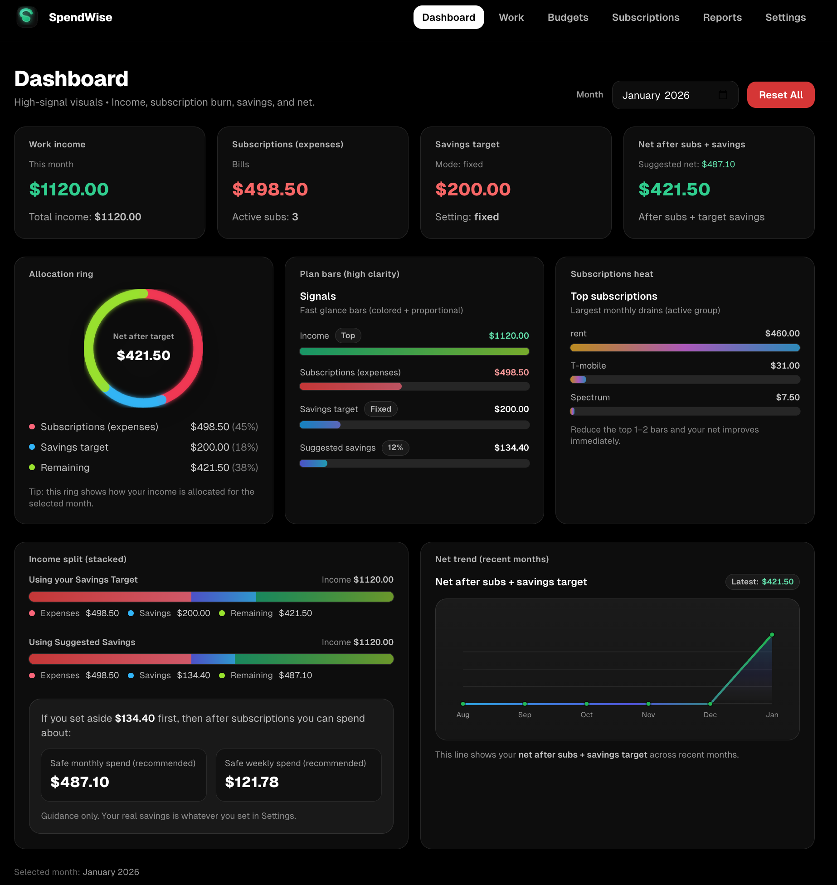

#  SpendWise

A premium, minimal personal finance tracker focused on monthly clarity: work income, subscription burn, savings planning, and a PDF report export.

---

## Overview

SpendWise is built for fast, accurate monthly decision-making. Pick a month and instantly see:

- Work income totals
- Subscription expenses (supports active “In use” subscription groups)
- Savings target (fixed amount or percentage)
- Net after subscriptions + savings
- Suggested savings guidance
- Safe weekly/monthly spending estimates
- PDF export for reporting

> Dashboard screenshot  
> Save your screenshot as `public/dashboard.png` to show it below.

---

## Core Features

### Dashboard
- Month selector (any month)
- High-signal summary cards (income, subscriptions, savings, net)
- Allocation ring visualization
- Plan bars (income vs expenses vs savings)
- Subscription heat / top drains
- Net trend across recent months

### Subscriptions + Groups
- Add subscriptions with monthly amounts
- Toggle active/inactive
- Create reusable groups and set one group as **“In use”**
- Dashboard automatically reflects the active group

### Reports
- Download PDF report via API route
- History tracking + clear history

### Local-first
- All data persists locally in the browser using `localStorage`
- No backend database required

---

## Tech Stack

- Next.js (App Router)
- TypeScript
- TailwindCSS
- Client state via `useSyncExternalStore`
- Storage: localStorage
- PDF export: `app/api/report/pdf`

---
